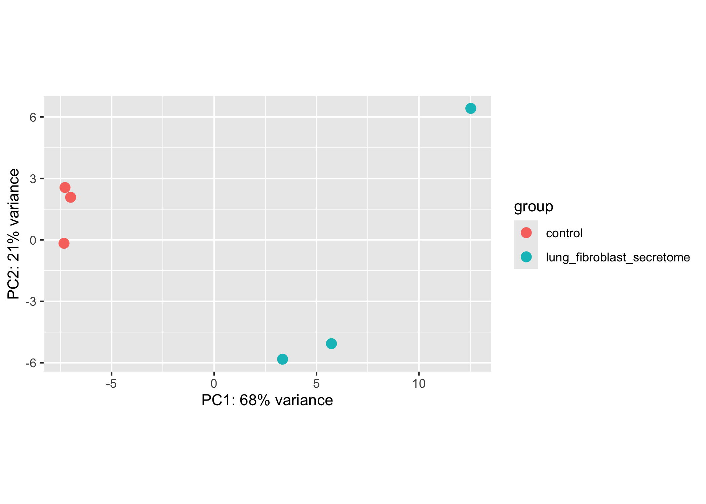
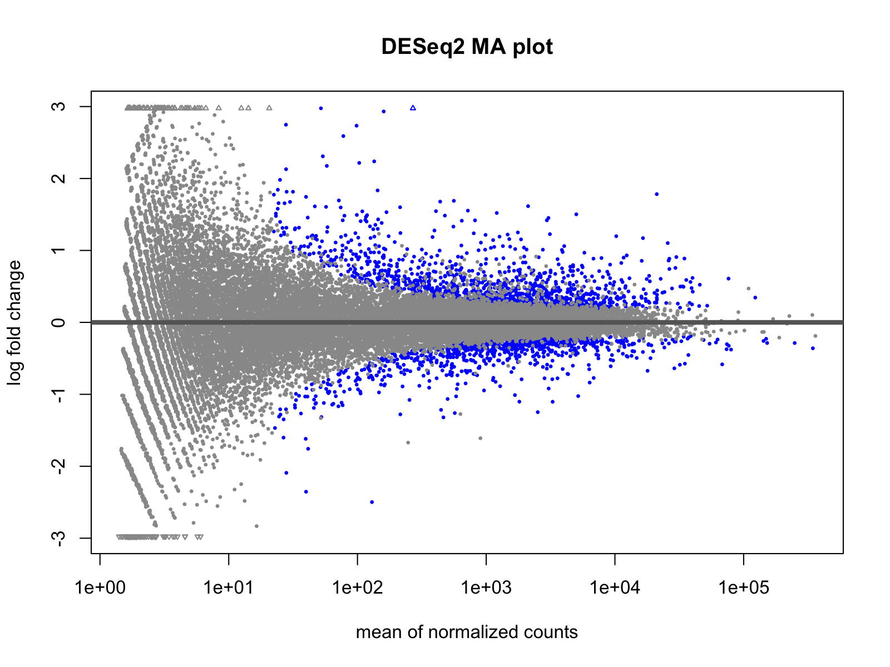
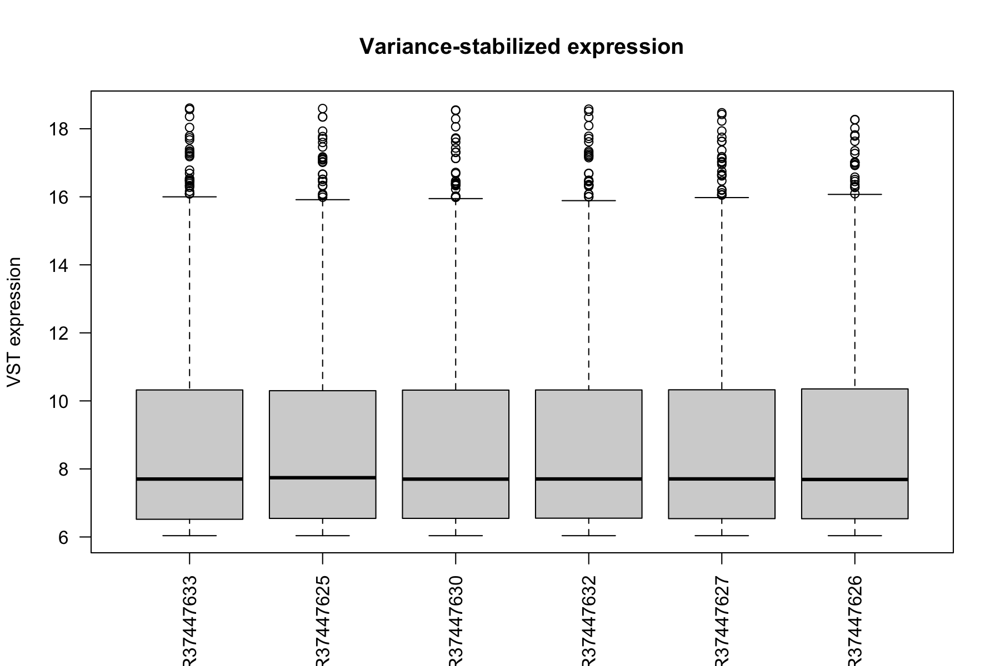

# RNA-seq Pipeline for Lung SCC Treatment Response

## Overview
This repository contains an end-to-end RNA-seq pipeline project for analysing transcriptional changes in the lung squamous cell carcinoma cell line SKMES1 under lung fibroblast secretome treatment versus control.

The workflow automates RNA-seq preprocessing from raw sequencing data and is designed to run reproducibly on both a local machine, and the QMUL Apocrita HPC cluster.

## Dataset
Source: NCBI SRA, BioProject PRJNA1431392

Samples:
- Control: SRR37447630, SRR37447632, SRR37447633
- Treatment: SRR37447625, SRR37447626, SRR37447627

Pipeline workflow:
1. NCBI SRA
2. FASTQ generation (fasterq-dump)
3. Quality trimming (Trim Galore)
4. Genome alignment (HISAT2)
5. BAM sorting (SAMtools sort)
6. BAM indexing (SAMtools index)
7. Gene quantification (featureCounts)
8. gene_counts.txt
9. Differential expression analysis (DESeq2)
10. QC visualisation

## Project structure
```text
rna-seq-pipeline-nextflow/
│
├── workflow/
│   └── main.nf
│
├── analysis/
│   ├── deseq2_analysis.R
│   ├── plots/
│   │   ├── pca_plot.png
│   │   ├── ma_plot.png
│   │   └── vst_expression_boxplot.png
│   │
│   └── results/
│       └── significant_genes_padj0.05_log2FC1.csv
│
├── workflow/
├── download_fastq.sh
├── build_index.sh
├── run_nextflow.sh
├── samples.csv
├── README.md
└── .gitignore
```

Large files are excluded from Git using .gitignore, such as:
- FASTQ files
- BAM files
- HISAT2 index
- featureCounts outputs

## Software
- Nextflow
- Trim Galore
- HISAT2
- SAMtools
- featureCounts (Subread)
- Slurm (Apocrita HPC)

## Running the Pipeline
The workflow is organised into three scripts to separate one-time setup steps from the main analysis.
- download_fastq.sh
Downloads the RNA-seq datasets from the NCBI SRA and converts them to paired-end FASTQ files.
- build_index.sh
Builds the HISAT2 genome index from the reference genome. This step only needs to be performed once for a given reference genome.
- run_nextflow.sh
Submits the Nextflow RNA-seq workflow to the QMUL Apocrita HPC cluster using Slurm.

Run the scripts in the following order:
```bash
sbatch download_fastq.sh
sbatch build_index.sh
sbatch run_nextflow.sh
```

If the pipeline is interrupted, it can be resumed without repeating completed steps using:
```bash
nextflow run workflow/main.nf -resume
```

## Results
The RNA-seq workflow completed successfully for all six SKMES1 samples (3 control and 3 lung fibroblast secretome-treated samples).

### Quality control
- All samples achieved approximately 94% overall alignment rate.
- PCA showed clear separation between control and treated samples along the first principal component, indicating treatment-associated transcriptional differences.
- Sample-to-sample correlation heatmap showed clustering of biological replicates, although a greater variability was found for one treated sample (SRR37447626) compared to the other treatment replicates.
- Expression distributions were comparable across all samples, suggesting no obvious technical bias.

### Differential expression analysis
DESeq2 analysis identified genes differentially expressed between lung fibroblast secretome-treated and control SKMES1 cells.
Results are provided as:
- analysis/results/deseq2_results.csv
- analysis/results/significant_genes_padj0.05_log2FC1.csv
Quality control figures:
- PCA plot
- MA plot
- Variance-stabilized expression boxplot

## Example QC Figures
### PCA


### MA Plot


### VST Expression Distribution


## Current Status
- ✓ Downloaded RNA-seq data from NCBI SRA
- ✓ Built the HISAT2 reference genome index
- ✓ Performed quality trimming using Trim Galore
- ✓ Aligned reads to the reference genome with HISAT2
- ✓ Sorted and indexed BAM files using SAMtools
- ✓ Quantified gene expression using featureCounts
- ✓ Successfully executed the workflow on the QMUL Apocrita HPC cluster
- ✓ Differential expression analysis with DESeq2
